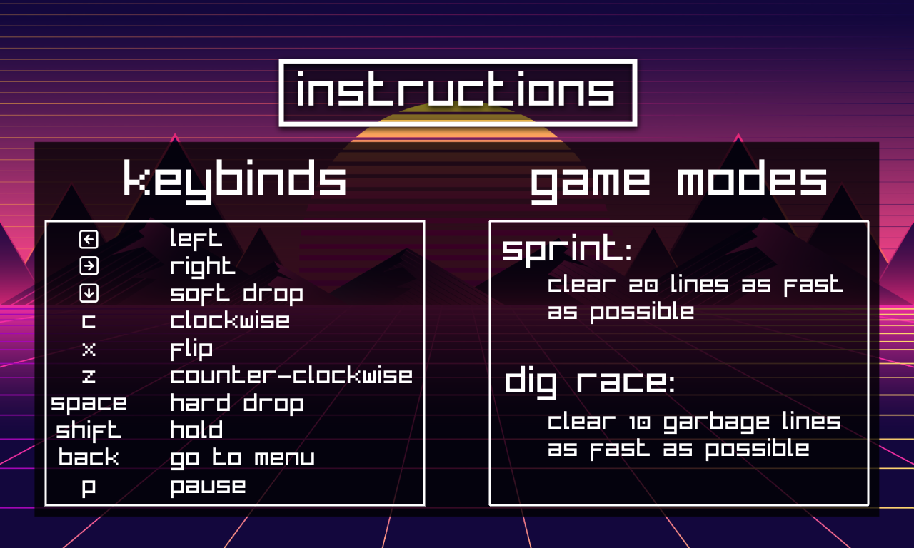
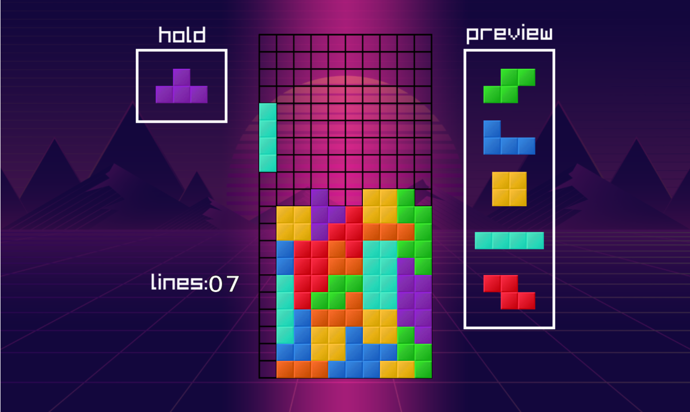
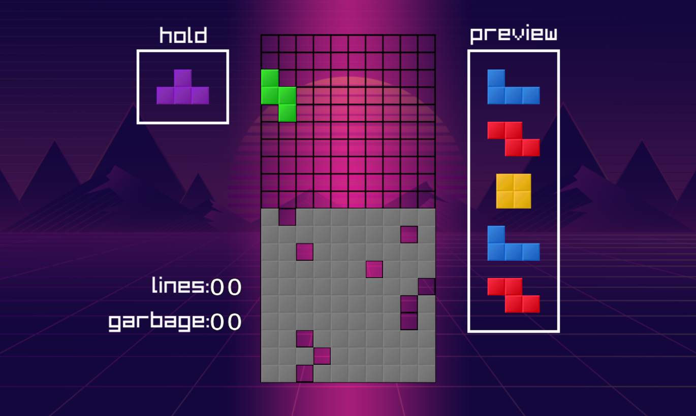
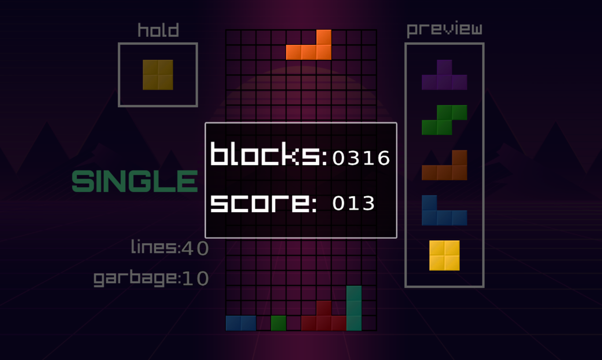

# Tetris Trainer

## Equipo de desarrollo
- Sorrentino Tadeo
- Torres Santiago

## Capturas

## Reglas de Juego / Instrucciones

El juego "Tetris Trainer" es una adaptación de Tetris singleplayer diseñada para que los jugadores puedan mejorar su habilidad en este clásico juego. 
Los modos de juegos serán:

#### Sprint:
Modo Clásico de Tetris moderno.
El tablero comienza vacío y el objetivo es limpiar 20 líneas lo más rápido posible.

#### Dig race:
El objetivo principal es limpiar, lo más rápido posible, un número determinado de líneas que están bloqueadas por residuos o "garbage" generados en el tablero.
Estas líneas tienen huecos en diferentes posiciones, lo que obliga al jugador a pensar cuidadosamente como poner las piezas poder limpiar las líneas.

El juego se adherirá a los estándares actuales del reglamento del Tetris, contando con controles modernos similares a los de Tetr.io, permitiendo a los jugadores realizar movimientos como:
- Desplazamientos laterales.
- Rotación en sentido horario y antihorario, junto con una opción de rotación de 180°.
- Hold: Guardar una pieza para usarla más tarde.
- Drop (caída rápida)
- HardDrop (caída instantánea).

El sistema de rotación utilizado será el Super Rotation System (SRS), el estándar más común en versiones modernas de Tetris. Este permite técnicas avanzadas como los T-Spins y otras rotaciones especiales.

Además, se empleará un randomizador de 7-bag, que garantiza que las siete piezas diferentes aparezcan una vez en cada ciclo antes de repetirse.

Se presentarán estadísticas al finalizar el juego que evaluan cuán eficiente fue el jugador a la hora de poner las piezas. 

## Otros

- Curso k2005, Universidad Tecnológica Nacional facultad regional Buenos Aires
- Versión de wollok : 0.2.7
- Una vez terminado, no tenemos problemas en que el repositorio sea público
